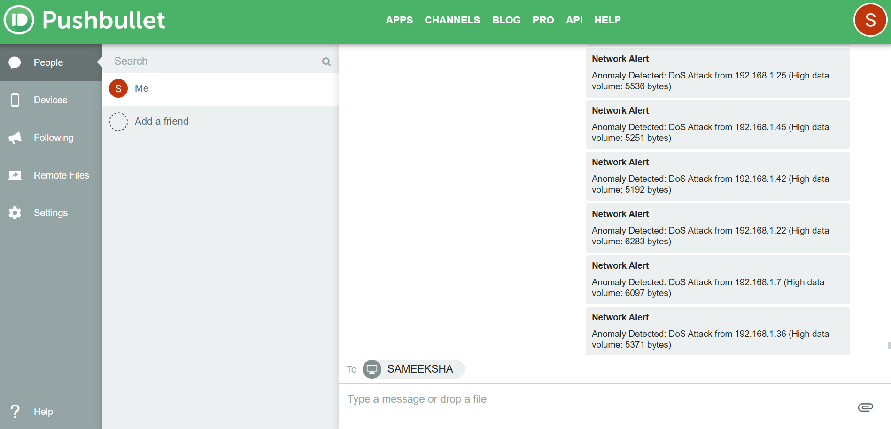

# 🛡️ Intrusion Detection System – UI-based Monitoring Tool

A Python-based system designed to simulate an **Intrusion Detection System (IDS)** using a simple and interactive interface. Built with `ipywidgets` inside a Jupyter Notebook, it allows users to **start and stop monitoring** and receive real-time alerts via **Pushbullet**.

---

## 🔍 Project Overview

This tool was developed to demonstrate how security monitoring systems can be **controlled via a user-friendly interface** and send **real-time notifications** on suspicious activity. It simulates the behavior of a lightweight IDS prototype.

---

## 🛠️ Technologies Used

- **Python**
- **Jupyter Notebook**
- **ipywidgets** – for the interactive Start/Stop buttons
- **Pushbullet API** – to send alerts as push notifications
- `threading` – for non-blocking background monitoring

---

## ⚙️ Features

- ✅ Start and stop the monitoring process via UI buttons  
- 🔄 Runs the monitoring in a separate thread (non-blocking)  
- 📱 Sends real-time alerts using Pushbullet (to mobile or browser)  
- 🖥️ Clean and minimal user interface inside Jupyter  
- 📸 Optional screenshot logs to demonstrate alerts

---

## 📸 Alert Example

  
*Screenshot of a Pushbullet message triggered from the system.*

---

## 🚀 Getting Started

1. Clone the repo or download the `.ipynb` file.
2. Install required libraries:
   ```bash
   pip install ipywidgets requests
3. Make sure to generate your Pushbullet Access Token from:
👉 https://www.pushbullet.com/#settings
4. Replace your API key in the notebook
5. Run the notebook and test the monitoring system.
